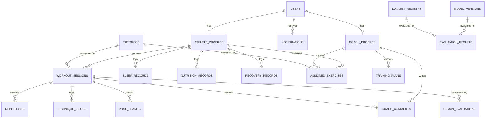

# SportX: Architecture Specification

## 1. Architectural Overview

SportX follows a decoupled, service-oriented architecture designed to balance real-time, low-latency edge inference with robust server-side machine learning experimentation and secure relational persistence.

```
+-----------------------------------------------------------------------------------+
|                                 CLIENT TIER                                       |
|                                                                                   |
|  +---------------------------+             +----------------------------------+   |
|  |  Live Camera HUD Studio   |             |    Video Upload Analysis Studio  |   |
|  |  (Webcam + 2D Canvas)     |             |    (Drag & Drop Video Pipeline)  |   |
|  +-------------+-------------+             +----------------+-----------------+   |
|                |                                            |                     |
|  +-------------+-------------+             +----------------+-----------------+   |
|  |    Athlete Dashboard      |             |     Coach Command Center         |   |
|  |  (Workouts, Sleep, Rec)   |             |   (Roster, Alerts, Programs)     |   |
|  +---------------------------+             +----------------------------------+   |
|                                                                                   |
|  +----------------------------------------------------------------------------+   |
|  |                     Scientific Research Laboratory                         |   |
|  |      (Dataset Registry, Benchmark Runner, Human-AI Inter-Rater Tool)       |   |
|  +----------------------------------------------------------------------------+   |
+------------------------------------------+----------------------------------------+
                                           | REST / JSON / Multipart
                                           v
+-----------------------------------------------------------------------------------+
|                                BACKEND API TIER                                   |
|                                                                                   |
|  +----------------------------------------------------------------------------+   |
|  |                             FastAPI App Router                             |   |
|  |  /auth  •  /athletes  •  /coaches  •  /exercises  •  /analysis  •  /research |   |
|  +----------------------------------------------------------------------------+   |
|  | Core Middleware: CORS, OAuth2 JWT Bearer, Exception Handling, Pydantic v2  |   |
|  +---------------------------------------+------------------------------------+   |
|                                          |                                        |
+------------------------------------------|----------------------------------------+
                                           |
         +---------------------------------+---------------------------------+
         |                                                                   |
         v                                                                   v
+----------------------------------+               +----------------------------------+
|      BIOMECHANICS & CV CORE      |               |     MACHINE LEARNING SUITE       |
| - MediaPipe Pose (33 3D Joints)  |               | - Subject-Wise Splitter          |
| - Body-Relative Normalization    |               | - Benchmark Data Generator       |
| - Kinematics Tracker (vel, acc)  |               | - Random Forest / XGBoost Models |
| - Symmetry Engine (BSI)          |               | - Temporal 1D-CNN Sequence Model |
| - State Machine Analyzers:       |               | - Multi-Class Confusion Matrix   |
|   * Squat, Push-up, Curl, Press  |               | - Inter-Rater Reliability Tool   |
| - Transparent 0-100 Scoring      |               +----------------------------------+
| - Actionable Youth Feedback      |
+----------------------------------+
                                           |
                                           v
+-----------------------------------------------------------------------------------+
|                                PERSISTENCE LAYER                                  |
|  SQLAlchemy 2.0 ORM + Normalized Schema (SQLite / PostgreSQL Compatible)          |
|  Entities: Users, AthleteProfiles, CoachProfiles, Exercises, WorkoutSessions,     |
|            Repetitions, TechniqueIssues, Sleep, Nutrition, Recovery, Alerts       |
+-----------------------------------------------------------------------------------+
```

---

## 2. Technology Stack

| Layer | Technology | Rationale |
|---|---|---|
| **Frontend UI** | React 18 + TypeScript + Vite | Type-safe component tree with fast HMR and optimized production bundles. |
| **Styling** | Tailwind CSS + Lucide Icons | Sports tech visual language with dark glassmorphism and clear status indicators. |
| **Backend Framework**| FastAPI (Python 3.12) | Asynchronous execution, automatic OpenAPI schema generation, high performance. |
| **Data Validation** | Pydantic v2 | High-speed request/response schema parsing and serialization. |
| **ORM & Database** | SQLAlchemy 2.0 (SQLite / PostgreSQL) | Relational integrity with clean migrations and foreign key cascading. |
| **Computer Vision** | MediaPipe Pose + OpenCV | 33 3D full-body landmarks, web and live stream compatibility without massive GPU overhead. |
| **Machine Learning**| Scikit-learn + NumPy + SciPy | Classical ensemble classifiers (Random Forest, Gradient Boosting), 1D Temporal CNN models, statistical testing. |

---

## 3. Database Schema Entity Relationships



---

## 4. Security & Privacy Model

1. **Authentication**: Bcrypt password hashing with individual salts + standard HS256 JWT access tokens with 7-day expiration.
2. **Role-Based Access Control (RBAC)**: Distinct permissions for `athlete`, `coach`, `researcher`, and `admin`.
3. **Youth Data Protection**:
   - Anonymized research subject IDs (e.g. `SUBJ_YOUTH_001`) decouple biological identification from kinematic sequences.
   - Athlete workout data is strictly isolated; coaches can only inspect athletes with an active `CoachAthleteRelationship`.
   - Raw video uploads can be optionally processed in-memory or scheduled for automated deletion according to retention policies.
